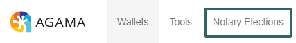
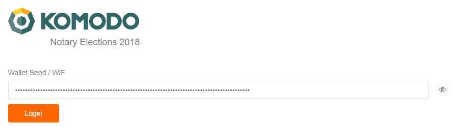
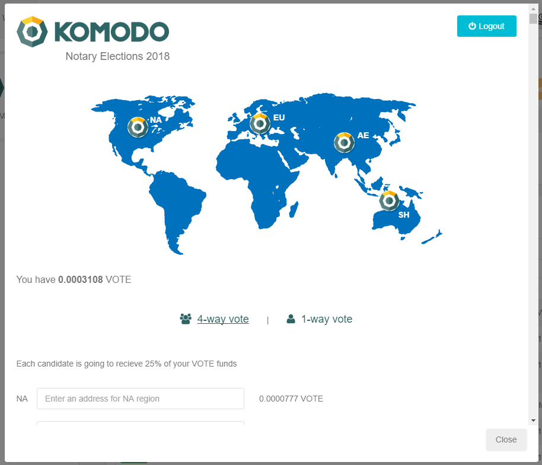
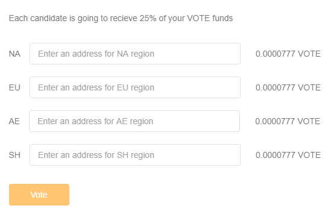
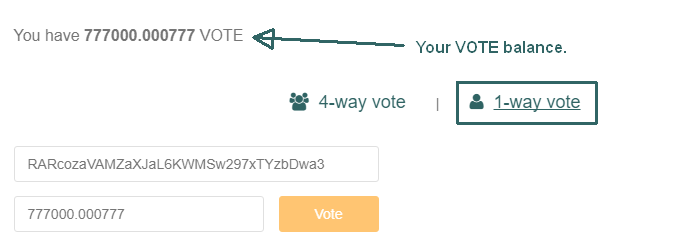

## How to vote for [Decker](https://github.com/KomodoPlatform/vote2018/blob/master/proposals/decker/README.md)? ##

- First of all you'll need to download and install latest version of Agama Wallet for your OS:

	- [Windows](https://artifacts.supernet.org/latest/installer_windows.html)
	- [Linux](https://artifacts.supernet.org/latest/installer_linux.html)
	- [MacOS](https://artifacts.supernet.org/latest/installer_osx.html)

- Currently (`3/13/2018 4:19:27 PM`) the latest version is **0.2.0.30b-beta**. Make sure that your use this or higher version, before voting.
- Navigate to `Notary Elections` top menu:

And enter your passphrase (seed) or WIF (private key in wallet import format):

And press `Login` button.
- You should see the following screen:

Here is your amount of available **VOTEs** (VOTEs will be available right after snapshot, which planned on 18/03/2018 00:00 UTC in the ratio **1:1**, for each 1 KMD you are holding you should receive **1 VOTE** on the same address). 
- You can VOTE two ways: `4-way vote` and `1-way vote`, if you are using 4 way-vote each candidate is going to recieve 25% of your VOTE funds: 

 
If you choose one way vote, all votes will be received by one candidate. Recommended way is to vote for 4 candidates in each region - NA, EU, AE, SH. List of candidates and their proposals you can found here:

- https://github.com/KomodoPlatform/vote2018
- https://dexstats.info/vote2018.php
- http://pad.supernet.org/notary-candidates-2018
	

To vote for [Decker](https://github.com/KomodoPlatform/vote2018/blob/master/proposals/decker/README.md) send your votes to `RARcozaVAMZaXJaL6KWMSw297xTYzbDwa3` t-address. Also, available z-address `zc9re8upRd4zZQ7Zs1qm1BnsXtEQ8yhQm3UeWkAugto5FwfgH6NoKTGqKM47K2QNus3CV5h3Kd3wUfzzjctZvj5S3EDFZqH` for advanced users:

 
